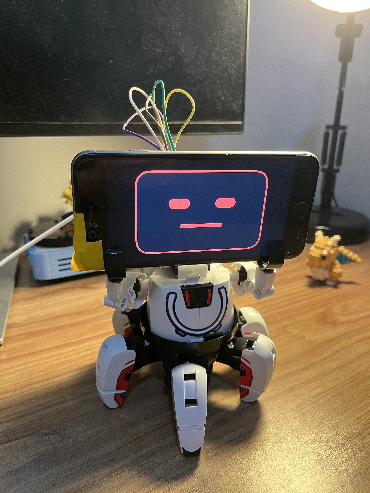

# Pascal

Code for my robot.



> "I'm sorry Dave, I'm afraid I can't do that"

## Quickstart

```sh
# Fill in environment variables
cp .env.example .env

# Build and upload the esp8266 http server to the board
WIFI_SSID='your-ssid' WIFI_PASSWORD='your-password' pio run --target upload

# Run the hub server
./run-dev.sh
```

You can get your favourite agent to drive the robot. Just connect to the MCP server at

```
http://<hub-ip>/mcp
```
